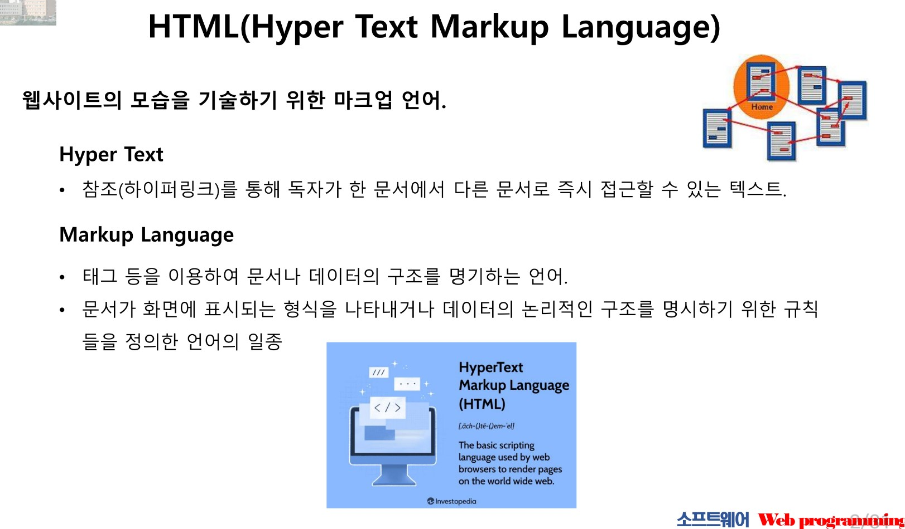
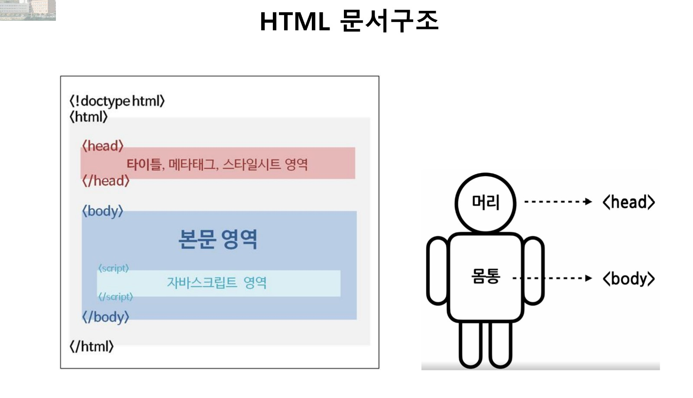
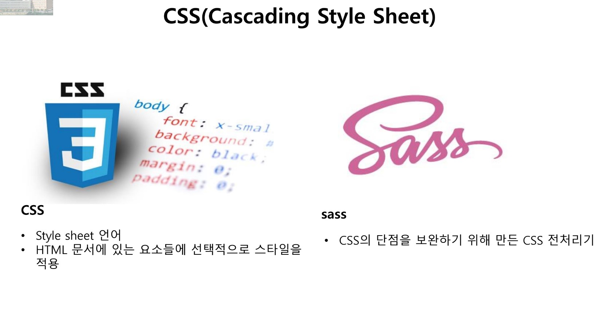
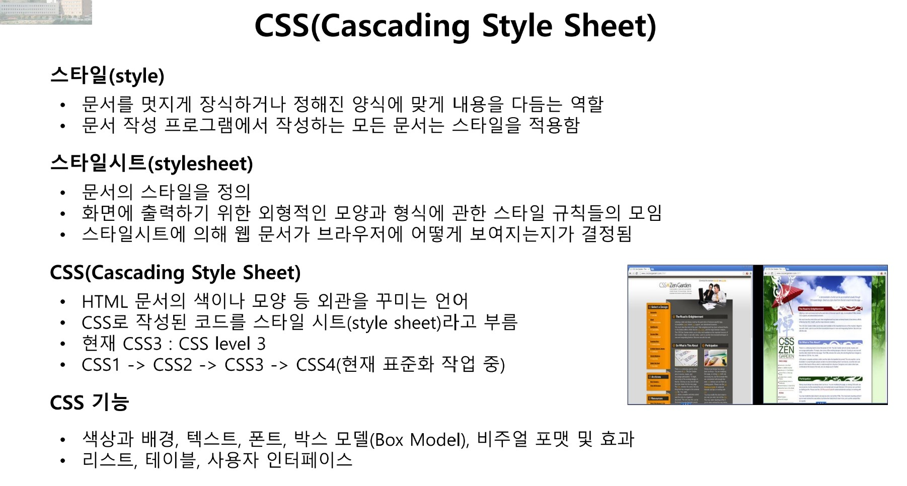
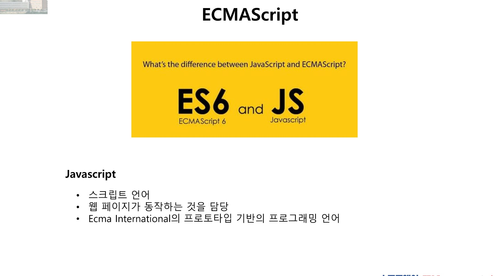
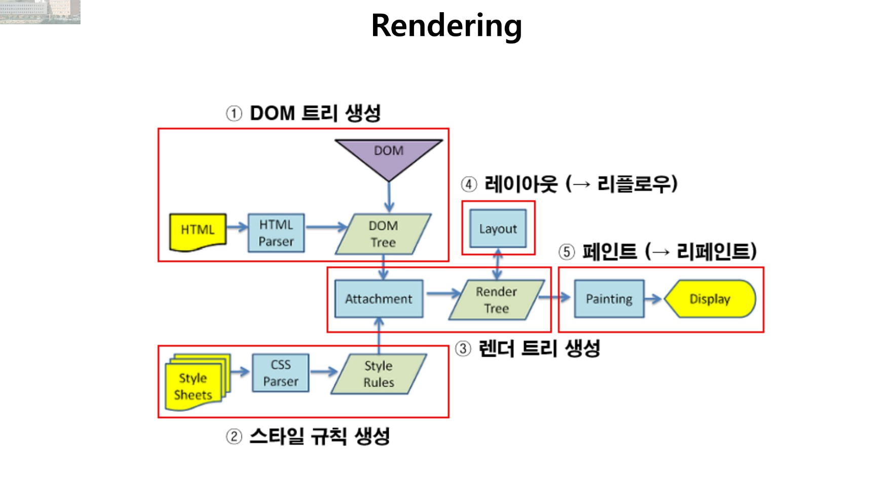

## Class0311 수업 정리

### Express 발표
<a href="https://dpwls03.github.io/React/0311/Express(2022764048 최예진).pdf">[발표자료]</a>

[발표내용]

Express와 Node.js에 대한 내용

Express는 웹 애플리케이션 개발에 사용이 되며, Node.js를 위한 웹 프레임워크이다.

Node.js는 Node.js는 Javascript 실행 환경으로, Javascript 코드를 실행할 수 있게 해주는 플랫폼이다.

+) Express 코드 ("Hello World" 출력하기)

### 수업내용

문서의 내용을 구조화하는 것 웹페이지 표시를 위해 개발된 마크업 언어

&lt;!doctype html&gt;은 HTML5를 표준하겠다는 뜻이다. 
&lt;head&gt;는 타이틀, 스타일시트등을 위한 영역이다. &lt;body&gt;는 document를 담당하고 있다.

document는 JavaScript에서 현재 웹 페이지를 나타내며, 이를 통해 웹 페이지의 구조와 내용을 조작할 수 있다.

CSS는 Style sheet언어이다. CSS(Cascading Style Sheet)에서 Cascading이란 우선순위가 가장 큰 스타일시트를 적용할 수 있도록 하고 있다. sass의 가장 큰 특징은 기존 Sass의 문법에서, CSS의 원래 문법에서 사용되는 중괄호를 사용하여 CSS만 알던 사람들이 처음 접해도 직관적으로 의미를 이해할 수 있다는 것이다.

<a href="https://csszengarden.com/">[CSS ZEN GARDEN]</a> CSS 디자인 참고 웹사이트

Javascript는 웹페이지가 동작하는 것을 담당한다. 
ECMAScript는 스크립팅 언어를 어떻게 만들어야 하는지를 설명하는 일종의 설명서라고 생각하면 되고, 
JavaScript는 ECMAScript를 사양을 바탕으로 만들어진 언어인 것이다.
컴파일러는 고급언어로 쓰인 프로그램이 컴퓨터에서 수행되기 위해서 컴퓨터가 이해할 수 있는 언어로 바꿔주어야 하는데 이러한 일을 하는 프로그램을 컴파일러라고 한다. 컴파일러는 소스를 한꺼번에 한 번만 읽고 분석한다.(번역) 
인터프리터는 컴파일러는 소스를 한 번에 기계어로 변환시키지만, 인터프리터는 코드 한 구문씩 기계어로 해석해나가면서 실행하는 프로그램이다.(통역) 
JavaScript엔진은 JavaScript코드의 인터프리터이다. 
Java는 하이브리드 언어라는 이름으로 불린다. 컴파일 언어와 인터프리터 언어를 혼합한 형태의 언어라는 의미인데, 처음에는 인터프리터 언어로써 사용되다가, 성능 향상을 위하여 컴파일 언어의 장점을 가져왔다고 한다.
<a href="https://sustainable-dev.tistory.com/105">[참고자료]</a>

렌더링은 HTML 글자로 된 걸 트리로 만들고 css도 트리 만들어서 이 두 개의 트리를 결합해 렌더링 트리를 만든다. 
그리고 각 노드의 크기와 위치를 계산하고 화면에 개별 노드 그림을 그리는 과정을 렌더링이라고 한다.

