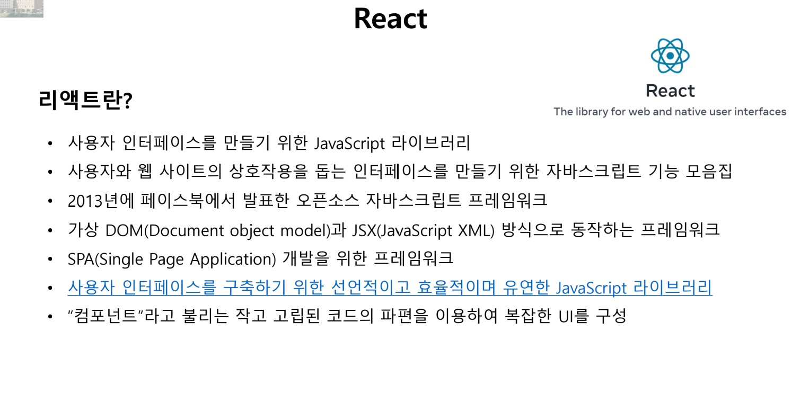

## Class0318 수업 정리

### 수업내용

리액트란 URL을 만들기위한 프론트엔드를 위한 것이다.

리액트의 장점은 유연성과 호환성, virtual DOM으로 강화된 고성능, 다양한 틀 제공등이 있고 단점은 광대한 학습량이다.

SPA를 개발하기 위한 것이고, 자바스크립트를 모음이라고 보면 된다.

<a href="https://docs.emmet.io/cheat-sheet/">[HTML, CSS 작성 참고자료]</a>

