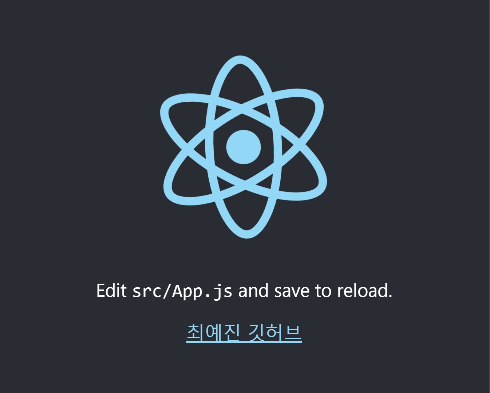
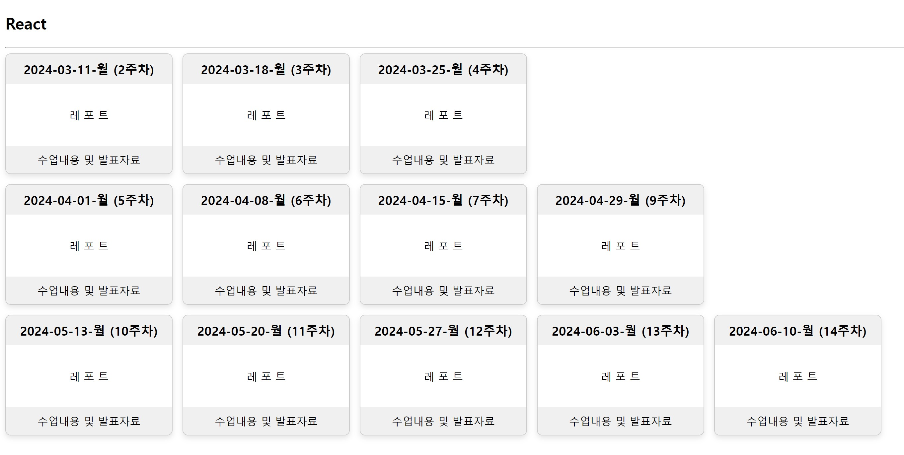

## Class0318 레포트

github pages에 react app 호스팅한 모습이다.

호스팅 방법은 vscode 터미널 창에서 "npx create-react-app 만들 파일명"을 입력한다.

그런 다음 "cd 내가 만든 파일명", "npm start"를 차례대로 입력한다.

package.json 파일에 "homepage":".",을 추가하고 App.js 파일에서 주소와 이름을 수정한다.

vscode 터미널 창에 "npm run build", "npm install -g serve", "serve -s build"를 입력한다.

위 이미지에서 최예진 깃허브를 누르면 https://dpwls03.github.io/React/ 페이지가 뜨게된다.
