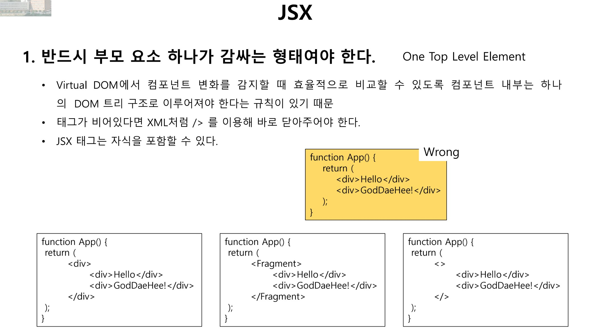
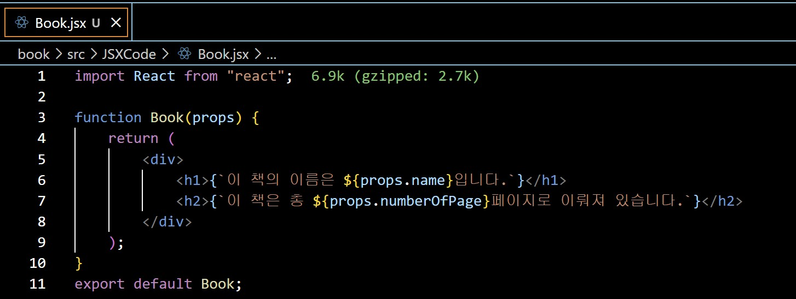

## Class0325 수업 정리

### Git과 Github 발표
<a href="https://dpwls03.github.io/React/0325/Github 협업하기.pdf">[발표자료]</a>

[발표내용]

github로 협업하기에 대한 내용입니다.

github는 버전 관리, 소스 코드 공유, 분산 버전 제어 등이 가능한 원격 저장소이다.

+) 깃허브 협업하기 실습

### 수업내용

JSX는 JavaScript XML을 의미한다.

자바스크립트 안에 html을 포함한 개념이고, 자바스크립트와 html의 조합이다.

화면에 표시될 내용을 html로 코드를 짜는데, body 안에 div 하나만 넣고 모든 코드를 자바스크립트로 짠다.
    

변수 선언 방법

var - 문제가 있어서 가급적 사용 안하는 것을 권장

const - 선언된 변수는 일정한 상수 값을 유지 (변경 불가)

let - 변경 가능한 변수 선언

const headingElement = document.createElement("h1"); - h1요소 만들기
headingElement.textContent = "안녕, 리액트!"; - 텍스트 내용을 "안녕, 리액트!"로 설정하기
rootElement.append(headingElement); - rootElement에 headingElement를 추가하여 &lt;div id="root"&gt; 요소 안에 &lt;h1&gt; 요소 삽입하기.

웹 브라우저는 html, css, Javascript만 인식한다.
  

리액트, jsx이런거를 자바스크립트 형태로 바꿔줘야 하는데 그것을 babel이 해준다.
  

jsx가 필수가 아니라서 선택적으로 사용해주면 된다.
 

methods 같은게 필요없고 바로 랜더링 가능하다.
   

HTML을 react elements로 바꿔준다.
  

methods 같은게 필요없고 바로 랜더링 가능하다.
   

HTML을 react elements로 바꿔준다.
 

jsx를 사용하면 코드가 좀 더 간단하고 간결해진다.
 

하나의 DOM 트리 구조로 이루어져야 한다는 규칙이 있다.
   

div와 같은 요소 이름을 사용하지 않고 그룹화 해주려면 &lt;Fragment&gt;, <> 를 사용해주면 된다. 
  

부모하나에 자식들이 포함되는 것이다.
 

표현식 = expression
 

constant(상수) - 변하지 않는 값으로, 예를 들어 숫자나 문자열 등이 있습니다. 상수는 프로그램 실행 중에 변경되지 않습니다.
 

variable(변수) - 값이나 데이터를 저장하는 공간으로, 해당 값은 프로그램 실행 중에 변경될 수 있습니다.
 

operator(연산자) - 데이터를 처리하거나 조작하는 데 사용되는 기호 또는 키워드입니다.
 

Function(함수) - 특정 작업을 수행하는 코드 블록으로, 이름을 가지고 있으며 호출되어 사용됩니다.
 

jsx는 if 구문 및 변수를 할당하고 인자를 받아들이고 함수로부터 반환할 수있다.
   

html을 쓸떄는 무조건 소문자로 쓴다.
   

xml, html 코드를 사용 시 중간에 자바스크립트 코드를 사용하고 싶으면 중괄호 {} 를 사용해서 묶어주면 된다.
   

jsx안에는 제어문을 쓸 수 없다. 그래서 자바스크립트로 위에 제어문을 만들어주고 그 결과를 jsx안에 넣게 된다.
   

만약에 jsx안에 제어문이 필요하면 삼항 연산자를 사용한다.

Book.jsx 코드
   

BookLibrary.jsx 코드
  

index.js 코드
 

코드 실행 화면
 