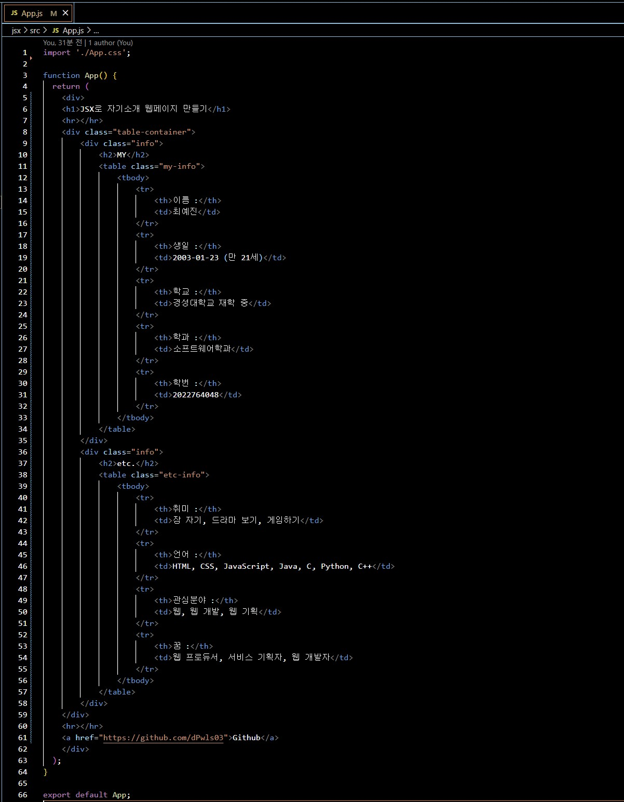
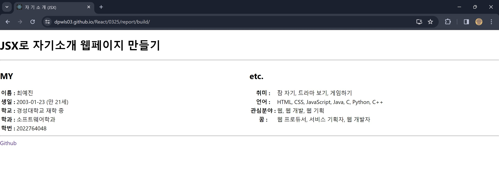

## Class0325 레포트

이 코드는 HTML로 간단한 자기소개 웹사이트를 만든 것이다.

HTML로 만든 웹사이트의 모습이다.

이 코드는 JavaScript로 간단한 자기소개 웹사이트를 만든 것이다.

JavaScript로 만든 웹사이트의 모습이다.

이 코드는 JSX로 간단한 자기소개 웹사이트를 만든 것이다.

JSX로 만든 웹사이트의 모습이다.

