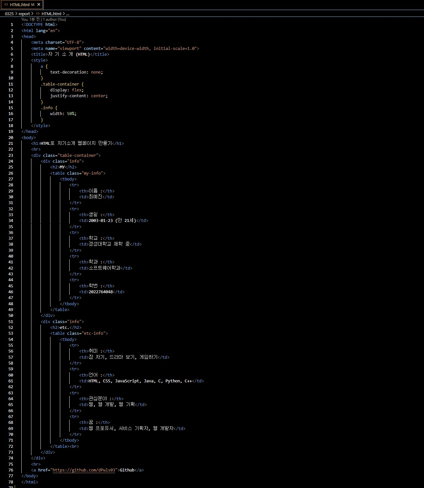

## Class0325 레포트

이 코드는 HTML로 간단한 자기소개 웹사이트를 만든 것이다.

HTML로 만든 웹사이트의 모습이다.

이 코드는 JavaScript로 간단한 자기소개 웹사이트를 만든 것이다.

JavaScript로 만든 웹사이트의 모습이다.

이 코드는 JSX로 간단한 자기소개 웹사이트를 만든 것이다.

JSX로 만든 웹사이트의 모습이다.

<a href="https://www.figma.com/file/vrN01FgxwMdUcf0lpttddI/%ED%94%BC%EA%B7%B8%EB%A7%88%EB%A1%9C-SPA-%EC%9B%B9-%EA%B8%B0%ED%9A%8D%ED%95%98%EA%B8%B0?type=design&node-id=0%3A1&mode=dev&t=pgkXsJD1zaQ8p7LY-1">피그마로 SPA 기획하기</a>

이것은 피그마로 SPA 기획한 모습이다.

<a href="https://www.figma.com/proto/vrN01FgxwMdUcf0lpttddI/%ED%94%BC%EA%B7%B8%EB%A7%88%EB%A1%9C-SPA-%EC%9B%B9-%EA%B8%B0%ED%9A%8D%ED%95%98%EA%B8%B0?type=design&node-id=19-1412&t=GL3upLRa2ZVdp0a0-1&scaling=scale-down&page-id=0%3A1&mode=design">피그마로 SPA 기획 동작보기</button></a>

위 링크로 들어가면 기획한 것의 동작을 볼 수 있다.

