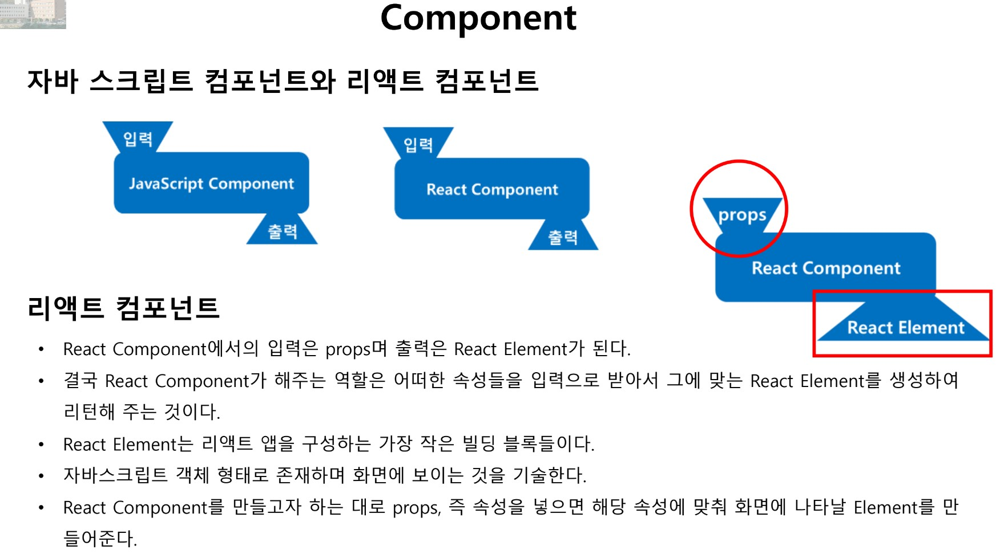
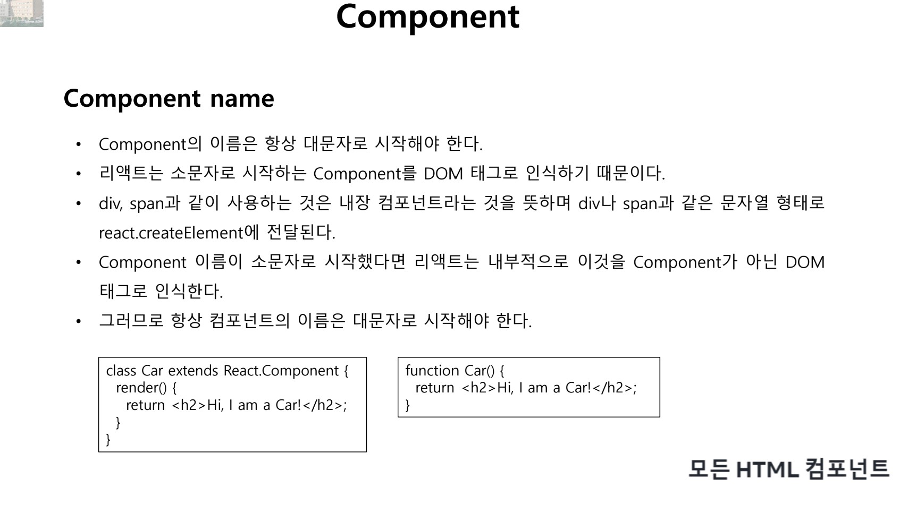
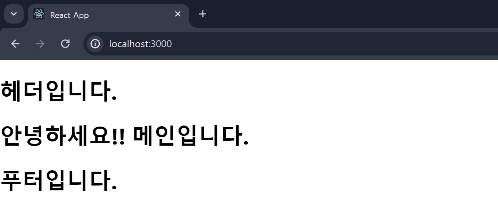
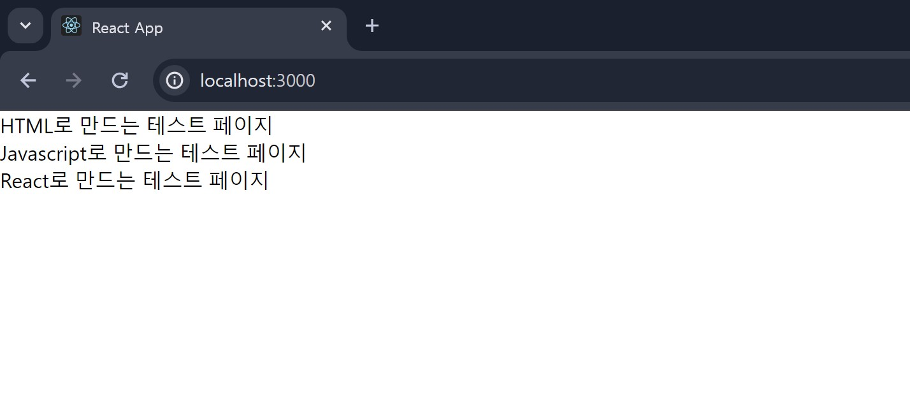
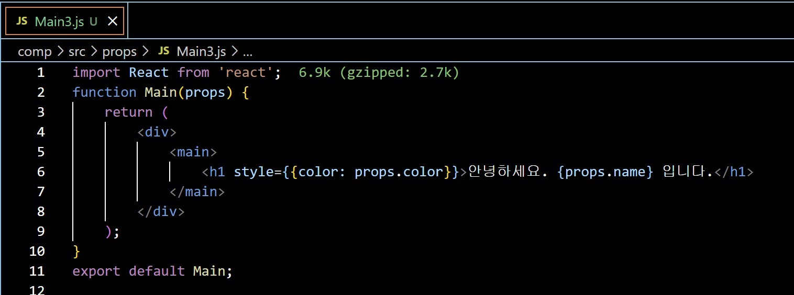
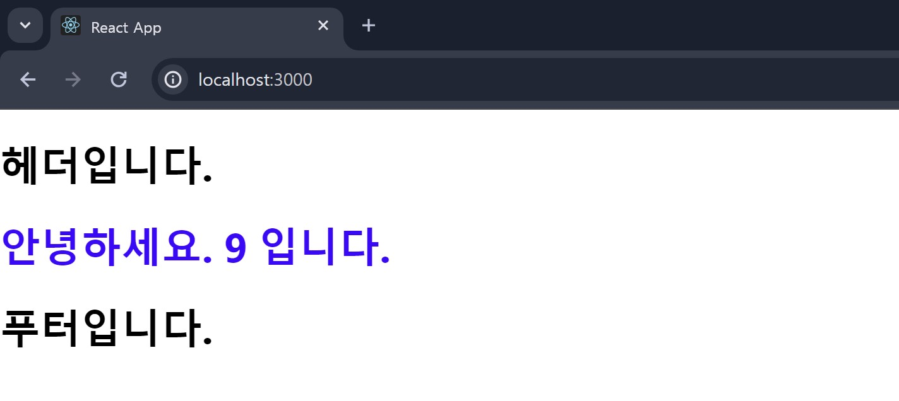
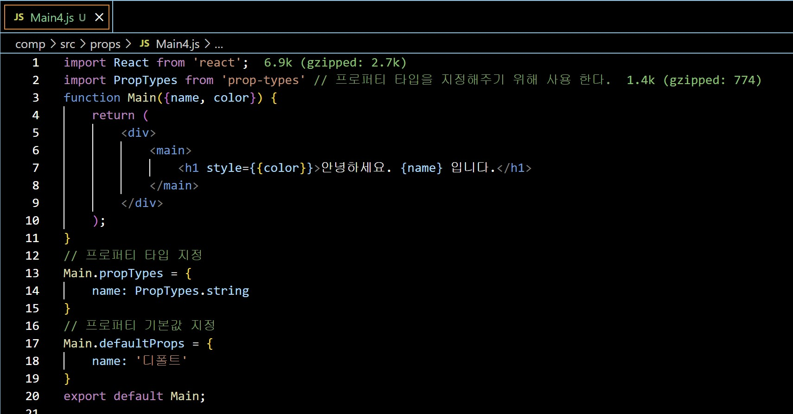
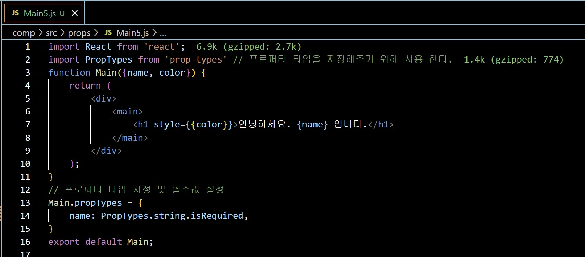

## Class0401 수업 정리

### 수업내용

컴포넌트는 함수, 객체와 비슷하다.

리액트 자체가 컴포넌트로 구성 되어있다.

자바스크립트의 함수처럼 작동해서 리액트 엘리먼트를 리턴한다.

웹 페이지를 만드는 조각들을 모아서 웹 페이지를 만들 수 있다.

리액트 컴포넌트는 입력이 props이고 출력이 React Element이다.

자바스크립트 객체 형태로 존재하며 화면에 보이는 것을 기술한다.

props는 component의 입력으로 들어간다.

입력만 바꾸면 출력되는 것이 다르게 나온다.

붕어빵 재료에 따라서 다양한 맛의 붕어빵이 나오는 것과 같다.

<a href="https://www.airbnb.co.kr/">컴포넌트 구성 예시 사이트</a>

리액트 컴포넌트는 Class Component와 Function Component로 나뉜다.

Class Component는 class를 사용해서 만들어진 형태의 컴포넌트이고 render() 메소드를 호출한다.

리액트 컴포넌트는 pure 함수 같은 역할을 해야한다. 하나의 객체를 받아 React element를 리턴하면 React Component라고 할 수 있는데 이런 것을 Function Component라고 한다.

컴포넌트는 항상 대문자로 시작해야한다. (사용자가 정의한 컴포넌트)

소문자로 시작하는 component는 DOM 태그로 인식한다. (HTML 태그)

이 두 개는 대소문자로 구분한다.

App.js가 Header.js, Main.js, Footer.js를 품었다. 그래서 Header.js, Main.js, Footer.js 파일의 부모는 App.js이다.

리액트 컴포넌트는 props를 이용해 서로 통신한다.

### 실습내용

#### Function Component

 

Function Component Header.js 코드
 
Function Component Main.js 코드

 

Function Component Footer.js 코드
 
Function Component App.js 코드

rsf (React Stateless Function Component의 약자)

실행화면

#### Class Component

 

Class Component Header.js 코드
 
Class Component Main.js 코드

 

Class Component Footer.js 코드
 
Class Component App.js 코드

rcc (React Class Component의 약자)

실행화면

#### 프로퍼티 예제

 

프로퍼티 예제 App.js 코드
 
프로퍼티 예제 MyComponent.js 코드

실행화면

#### 1개의 프로퍼티 넘기기

 

1개의 프로퍼티 넘기기 App.js 코드
 
1개의 프로퍼티 넘기기 Main.js 코드

실행화면

#### 2개의 프로퍼티 넘기기

 

2개의 프로퍼티 넘기기 App.js 코드
 
2개의 프로퍼티 넘기기 Main.js 코드

실행화면

#### 숫자 프로퍼티 넘기기

 

숫자 프로퍼티 넘기기 App.js 코드
 
숫자 프로퍼티 넘기기 Main.js 코드

실행화면

#### 프로퍼티의 기본값 설정

 

프로퍼티의 기본값 설정 App.js 코드
 
프로퍼티의 기본값 설정 Main.js 코드

실행화면

#### 프로퍼티의 필수값 설정

 

프로퍼티의 필수값 설정 App.js 코드
 
프로퍼티의 필수값 설정 Main.js 코드

실행화면

#### 불리언 프로퍼티 사용하기

 

불리언 프로퍼티 사용하기 App.js 코드
 
불리언 프로퍼티 사용하기 Main.js 코드

실행화면

#### props.children 활용하기

 

props.children 활용하기(Main 안 보임) App.js 코드
 
props.children 활용하기(Main 안 보임) Wrapper.js 코드

실행화면

 

props.children 활용하기(Main 보임) App.js 코드
 
props.children 활용하기(Main 보임) Wrapper.js 코드

실행화면

#### props.children 활용하기 (여러 개의 자식 사용)

 

props.children 활용하기 (여러 개의 자식 사용)App.js 코드
 
props.children 활용하기 (여러 개의 자식 사용) Wrapper.js 코드

실행화면
