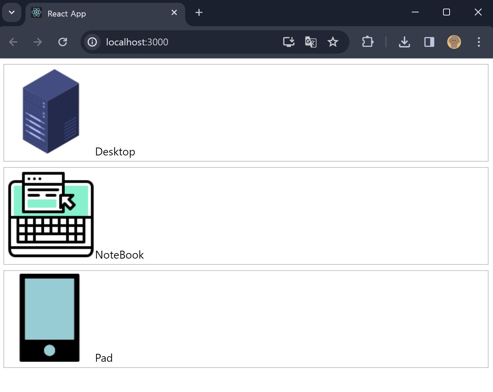
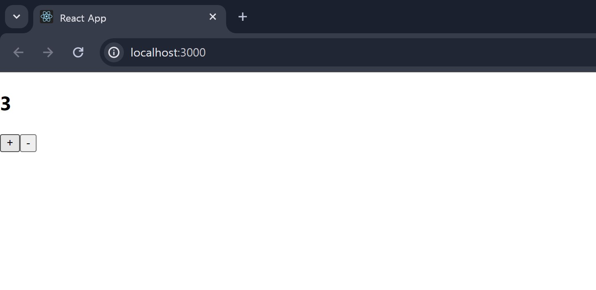

## Class0408 수업 정리

### 수업내용

img/는 public에 있는 img폴더를 가리킨다.

app.js를 수정해서 해도 되지만 index.html를 수정해도 실행이 가능하다.

state는 어떠한 값을 가지는 것이다.

값이 바뀌면 재 렌더링 되어 화면이 바뀐다.

state는 간단하게 말해서 변수이다.

props는 부모, 상위에서 전달 받기때문에 값을 바꿀수 없지만,

state는 값을 바꿀수있다. 그럼 재 렌더링이 된다.

컴포넌트 자신 만의 값을 가지고 있다.

컴포넌트의 데이터라는 의미가 가깝다.

컴포넌트가 가질 수 있는 값이다.

시간이 지남에 따라 변하는 데이터이다.

컴포넌트의 메모리

상태에 따라 변하는 동적 데이터

명시적으로 state를 기술해야한다.

내부적으로 상태를 관리해야 하는 일이 필요하다.

### 실습내용

#### imgtext 컴포넌트

RList.js 코드

App.js 코드

실행화면

#### 리스트 컴포넌트

RList.js 코드

App.js 코드

실행화면

#### 화살표 함수

arrow.js 코드

App.js 코드

실행화면

#### 댓글 컴포넌트

#### 댓글 컴포넌트 스타일 입히기

#### 댓글 컴포넌트 props 추가하기

#### 댓글 컴포넌트 데이터 객체로 분리하기

#### state 일반 변수

Counter.js 코드

App.js 코드

실행화면

#### state 사용

Counter.js 코드

App.js 코드

실행화면

#### state 비동기적 작동

Counter.js 코드

App.js 코드

실행화면

#### state 비동기적 작동 3증가

Counter.js 코드

App.js 코드

실행화면

#### state 비동기적 작동 콜백 함수 사용

Counter.js 코드

App.js 코드

실행화면

#### state 설정 및 사용 