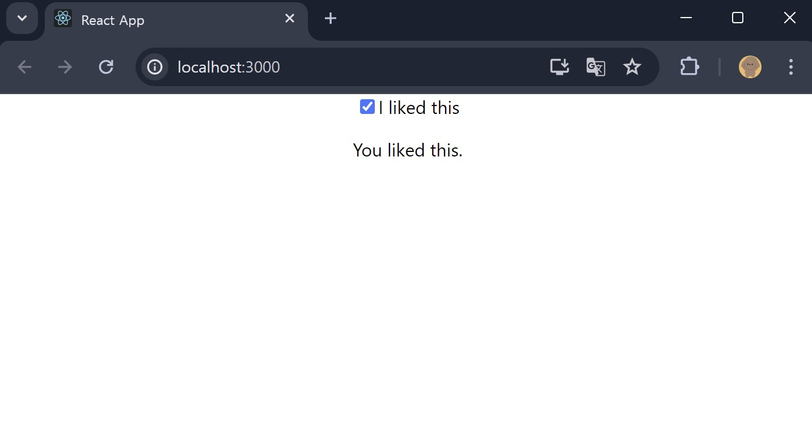

## Class0408 수업 정리

### 수업내용

리액트 컴포넌트는 함수형 컴포넌트, 클래스형 컴포넌트로 나뉜다.

함수형 컴포넌트가 사용된 이유는 클래스형 컴포넌트의 대표적인 단점 때문이다.

코드의 구성이 어렵고 컴포넌트의 재사용성이 떨어진다.  컴파일 단계에서 코드 최적화를 어렵게 한다.  최신 기술의 적용이 효과적이지 않다.

이러한 클래스형 컴포넌트의 단점을 보안하여, 함수형 컴포넌트를 사용할 수 있도록 등장한 것이 React Hook이다.

Hook의 장점은 상태 로직 단순화, 코드 재사용성과 관심사 분리, 사이드 이펙트 감소가 있다.

Hook은 두 가지 규칙을 준수해야한다.

최상위에서만 Hook을 호출해야한다.(반족문, 조건문 혹은 중첩된 함수 내에서 Hook을 호출하면 안된다.)

오직 React 함수 내에서 Hook을 호출해야 한다.

 

Hook은 일반 자바스크립트 함수에서 Hook을 호출하지 말아야 한다.

대신, React함수 구성요소에서 Hook을 호출하고, 사용자 지정 Hook으로부터 Hook을 호출할 수 있다.

Hook은 조건이나 루프 내부에서 Hook을 호출하지 말아야한다.

Hook은 조건부 반환(return)문 뒤에 Hook을 호출하지 말아야 한다.

Hook은 이벤트 핸들러에서 Hook을 호출하지 않는다.

Hook은 클래스 컴포넌트 안에 Hook을 호출하지 말아야 한다.

컴포넌트에 state variable를 추가할 수 있다.

variable = expression 할당연산자

여러번 리렌더링 되는 것을 방지할 수 있다.

렌더링 중 set 함수 호출은 현재 렌더링 구성 요소 내에서만 허용된다.

usestate 하나 이상의 상태 변수를 선언하려면 구성 요소의 최상위 수준에서 호출해야 한다.

처음에 사용자가 제공한 초기 상태로 설정, 다음 상태 값을 가진 set함수를 호출하면 된다.

set 함수를 호출해도 이미 실행 중인 코드의 현재 상태는 변경되지않는다.

렌더링 부터 반환되는 항목에만 영향을 미친다.

### 실습내용

#### Basic useState examples - Counter (number)

Counter.js 코드

App.js 코드

실행화면

#### Basic useState examples - Text field (string)

MyInput.js 코드

App.js 코드

실행화면

#### Basic useState examples - Checkbox (boolean)

MyCheckbox.js 코드

App.js 코드

실행화면

#### Basic useState examples - From (two variables)

From.js 코드

App.js 코드

실행화면

#### The difference between passing an updater and passing the next state directly example - Passing the next state directly

Counter.js 코드

App.js 코드

실행화면

#### The difference between passing an updater and passing the next state directly example - Passing the updater function

Counter.js 코드

App.js 코드

실행화면

#### Examples of objects and arrays in state - From (object)

From.js 코드

App.js 코드

실행화면

#### Examples of objects and arrays in state - From (nested object)

From.js 코드

App.js 코드

실행화면

#### Examples of objects and arrays in state - List (array)

AddTodo.js 코드

TaskList.js 코드

App.js 코드

실행화면

#### The difference between passing an initializer and passing the initial state directly example - Passing the initializer function

App.js 코드

실행화면

#### The difference between passing an initializer and passing the initial state directly example - Passing the initial state directly

App.js 코드

실행화면

#### Resetting state with a key

App.js 코드

실행화면

#### Storing information from previous renders

 

App.js 코드

CountLabel.js 코드

실행화면

