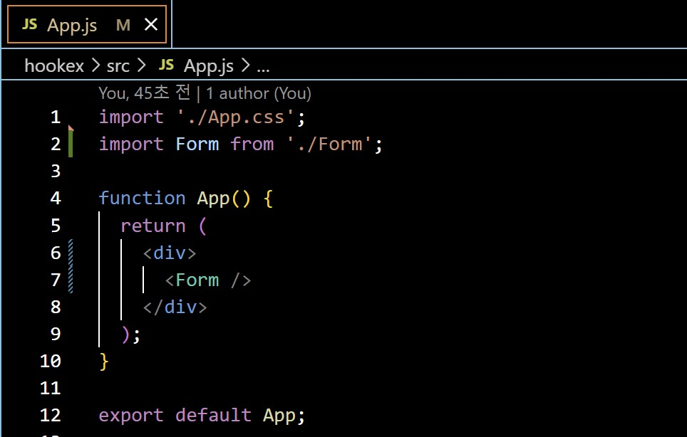
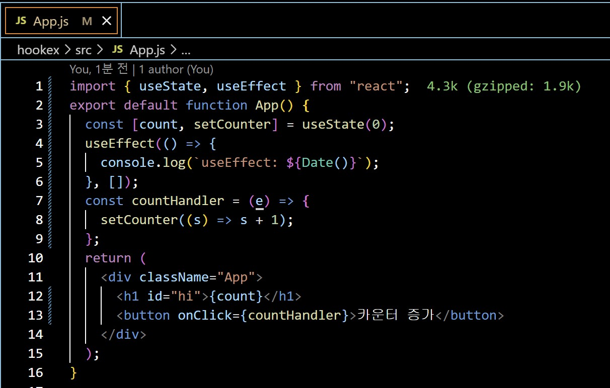

## Class0429 수업 정리

### 클로저 발표
<a href="https://dpwls03.github.io/React/0429/클로저.pdf">[발표자료]</a>

[발표내용]

클로저 함수에 대한 내용입니다.

클로저는 외부 함수의 컨텍스트에 접근할 수 있는 내부 함수를 뜻하고, 

외부 함수의 실행이 종료된 후에도, 클로저 함수는 외부 함수가 선언된 어휘적 횐경에 접근할 수 있습니다.

### 수업내용

useState 대신에 사용하는 useReducer

좀 더 복잡한 상태 관리가 필요한 경우 reducer를 사용할 수 있다.

reducer는 이전 상태와 Action을 합쳐, 새로운 state를 만드는 조작을 말한다.

1번 state를 사용하는건 같은데 2번 dispatch가 다르다.

dispatch는 type을 붙인다.

상기 dispatch 함수에 의해 실행되며, 컴포넌트 외부에서 state를 업데이트 하는 로직을 담당한다.

state와 action을 활용하여 새로운 state를 반환한다.

state를 변경하는 부분(Count를 감소, 증가 시키는 부분)이 useState와 같은 경우 내부에 위치하며,
useReducer와 같은 경우 외부에 위치 한다.

useReducer를 활용 한다면 좀더 복잡한 프로세스를 처리할 수 있을 것이다.

Context는 앱 안에서 전역적으로 사용되는 데이터를 여러 컴포넌트끼리 쉽게 공유할 수 있는 방법을 제공한다.

Context를 사용하면 Props로 데이터를 일일이 전달해 주지 않아도 해당 데이터를 가지고 있는
상위 컴포넌트에 그 데이터가 필요한 하위 컴포넌트가 접근할 수 있다.

상위 컴포넌트의 data가 필요한 하위 컴포넌트들은 useContext 훅을 사용해서 해당 데이터를 받아오기만 하면 된다.

useContext는 Context로 분류한 데이터를 쉽게 받아올 수 있게 도와주는 역할을 한다.

useRef는 저장공간 또는 DOM요소에 접근하기 위해 사용되는 React Hook이다.

우리가 자바스크립트를 사용 할 때에는, 우리가 특정 DOM 을 선택하기 위해서 querySelector 등의 함수를 사용한다.

부모 컴포넌트에서 자식 컴포넌트 안의 DOM element에 접근하고 싶다면, forwardRef를 사용해야 한다.

forwardRef는 부모 컴포넌트에서 생성된 ref를 자식 컴포넌트에게 전달하며, 이를 통해 부모 컴포넌트가 자식 컴포넌트의 인스턴스에 접근할 수 있도록 한다.

함수형 컴포넌트를 forwardRef로 감싸주게 되면 ref를 사용할 수 있다.
(+ 클래스로 선언된 컴포넌트들은 인스턴스를 가지기 때문에 ref 속성 사용 가능)

useImperativeHandle 훅은 자식 컴포넌트가 부모 컴포넌트로부터 함수나 메서드를 노출하고 커스터마이징할 때 사용된다.

이를 통해 부모 컴포넌트는 자식 컴포넌트 내부의 특정 함수나 메서드에 직접 접근할 수 있으며,
이를 활용하여 자식 컴포넌트의 인터페이스를 더 쉽게 조작하거나 노출할 수 있다.

useEffect 함수는 리액트 컴포넌트가 렌더링 될 때마다 특정 작업을 실행할 수 있도록 하는 Hook이다.

이를 통해 부모 컴포넌트는 자식 컴포넌트 내부의 특정 함수나 메서드에 직접 접근할 수 있으며,
이를 활용하여 자식 컴포넌트의 인터페이스를 더 쉽게 조작하거나 노출할 수 있다.

### 실습내용

#### init 함수를 사용하지 않는 counter 예시

Counter.js 코드

App.js 코드

실행화면

#### init 함수를 사용하여 counter 예시

Counter.js 코드

App.js 코드

실행화면

#### useState 사용

Counter.js 코드

App.js 코드

실행화면

####  state와 props만 사용해서 만든 웹사이트

App.js 코드

Page.js 코드

Header.js 코드

Content.js 코드

Footer.js 코드

실행화면

#### context를 사용해서 만든 웹사이트

App.js 코드

Page.js 코드

Header.js 코드

Content.js 코드

Footer.js 코드

ThemeContext.js 코드

실행화면

#### context의 값 변경하기

App.js 코드

실행화면

#### useRef 사용 예시 - 변수 관리

App.js 코드

실행화면

#### useRef 사용 예시 - DOM 요소 선택 1

DOMFocus.js 코드

App.js 코드

실행화면

#### useRef 사용 예시 - DOM 요소 선택 2

InputSample.js 코드

App.js 코드

실행화면

#### 부모 컴포넌트에 커스텀 함수 노출하기 1

ChildComponent.js 코드

ParentComponent.js 코드

App.js 코드

실행화면

#### 부모 컴포넌트에 커스텀 함수 노출하기 2

MyInput.js 코드

Form.js 코드

App.js 코드

실행화면

#### useEffect - 기본 사용법

App.js 코드

실행화면

#### useEffect - 세 가지 사용법 1. 무한반복

App.js 코드

실행화면

#### useEffect - 세 가지 사용법 2. 처음에만 실행

App.js 코드

실행화면

#### useEffect - 세 가지 사용법 3. 의존성 배열 사용

App.js 코드

실행화면

#### useEffect - cleanup

App.js 코드

실행화면

#### useLayoutEffect - useEffect 사용

App.js 코드

실행화면

#### useLayoutEffect - useLayoutEffect 사용

App.js 코드

실행화면

#### useLayoutEffect

Practice.js 코드

App.js 코드

실행화면

