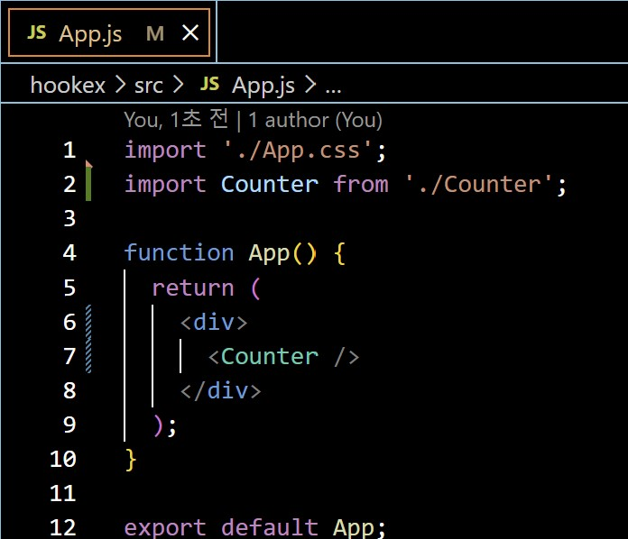
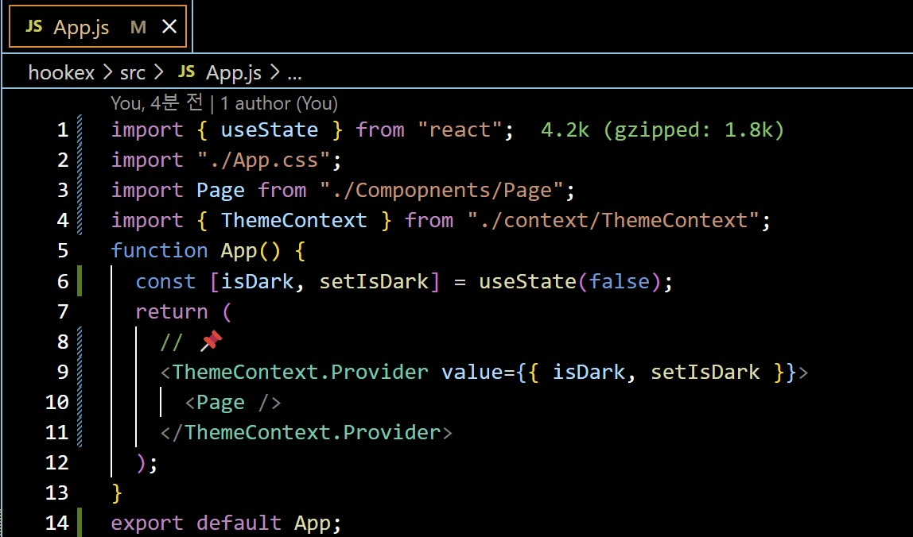
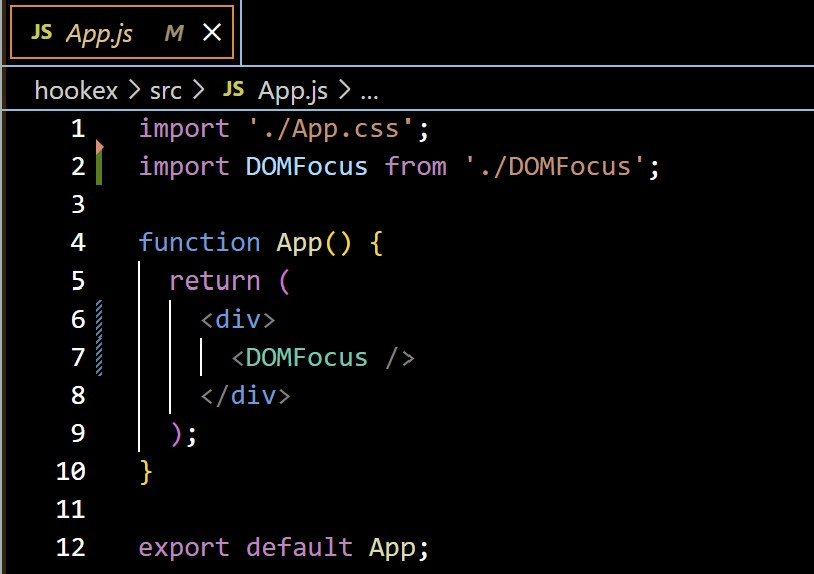

## Class0429 수업 정리

### 클로저 발표
<a href="https://dpwls03.github.io/React/0429/클로저.pdf">[발표자료]</a>

[발표내용]

클로저 함수에 대한 내용입니다.

클로저는 외부 함수의 컨텍스트에 접근할 수 있는 내부 함수를 뜻하고, 

외부 함수의 실행이 종료된 후에도, 클로저 함수는 외부 함수가 선언된 어휘적 횐경에 접근할 수 있습니다.

### 수업내용

### 실습내용

#### init 함수를 사용하지 않는 counter 예시

Counter.js 코드

App.js 코드

실행화면

#### init 함수를 사용하여 counter 예시

Counter.js 코드

App.js 코드

실행화면

#### useState 사용

Counter.js 코드

App.js 코드

실행화면

####  state와 props만 사용해서 만든 웹사이트

App.js 코드

Page.js 코드

Header.js 코드

Content.js 코드

Footer.js 코드

실행화면

#### context를 사용해서 만든 웹사이트

App.js 코드

Page.js 코드

Header.js 코드

Content.js 코드

Footer.js 코드

ThemeContext.js 코드

실행화면

#### context의 값 변경하기

App.js 코드

실행화면

#### useRef 사용 예시 - 변수 관리

App.js 코드

실행화면

#### useRef 사용 예시 - DOM 요소 선택 1

DOMFocus.js 코드

App.js 코드

실행화면

#### useRef 사용 예시 - DOM 요소 선택 2

InputSample.js 코드

App.js 코드

실행화면

#### 부모 컴포넌트에 커스텀 함수 노출하기 1

ChildComponent.js 코드

ParentComponent.js 코드

App.js 코드

실행화면

#### 부모 컴포넌트에 커스텀 함수 노출하기 2

MyInput.js 코드

Form.js 코드

App.js 코드

실행화면

#### useEffect - 기본 사용법

App.js 코드

실행화면

#### useEffect - 세 가지 사용법 1. 무한반복

App.js 코드

실행화면

#### useEffect - 세 가지 사용법 2. 처음에만 실행

App.js 코드

실행화면

#### useEffect - 세 가지 사용법 3. 의존성 배열 사용

App.js 코드

실행화면

#### useEffect - cleanup

App.js 코드

실행화면

#### useLayoutEffect - useEffect 사용

App.js 코드

실행화면

#### useLayoutEffect - useLayoutEffect 사용

App.js 코드

실행화면

#### useLayoutEffect

Practice.js 코드

App.js 코드

실행화면

