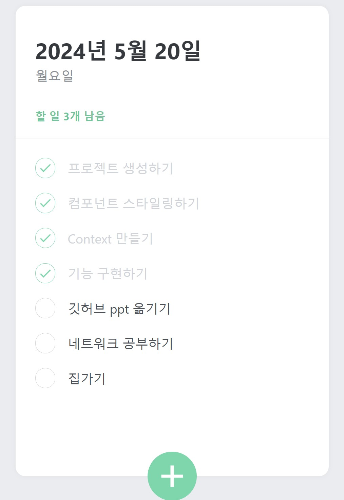

## Class0520 수업 정리

### 일급객체 발표
<a href="https://dpwls03.github.io/React/0513/일급객체.pdf">[발표자료]</a>

[발표내용]

일급객체에 대한 내용입니다.

일급객체란 다른 객체들에 일반적으로 적용 가능한 연산을 모두 지원하는 객체를 가리킵니다.

일급객체의 조건

1. 무명의 리터럴로 생성할 수 있다.
2. 변수나 자료구조(객체, 배열 등)에 저장할 수 있다.
3. 함수의 매개변수에 전달할 수 있다.
4. 함수의 반환값으로 사용할 수 있다.

### 수업내용

#### TodoList 만들기

<a href="https://dpwls03.github.io/React/0520/build/">[TodoList]</a>
