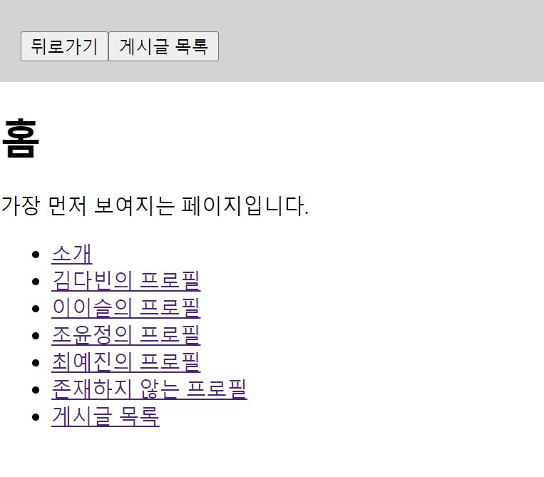
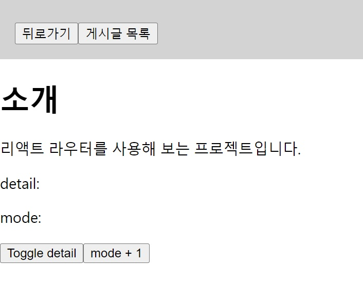
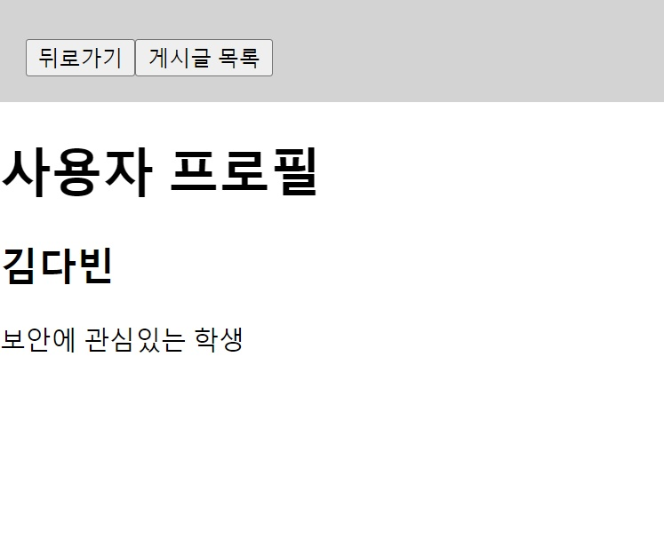
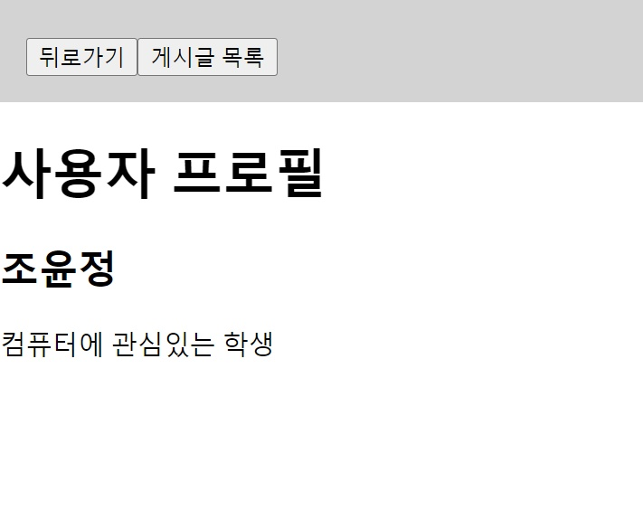
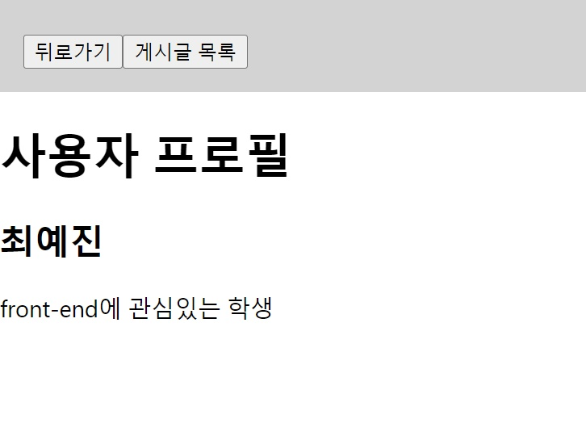
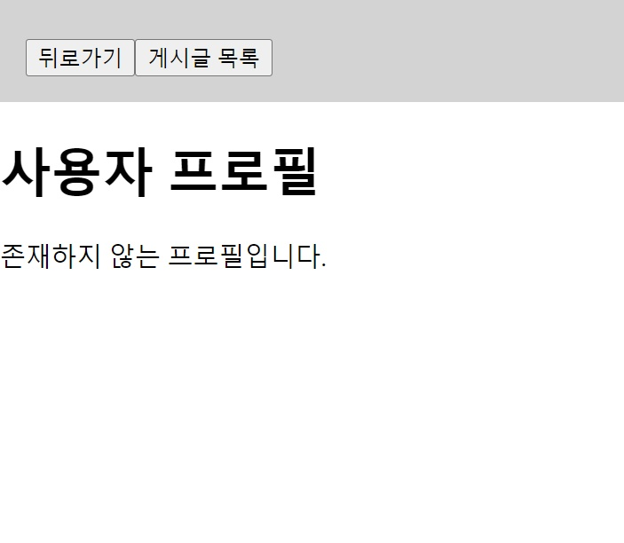
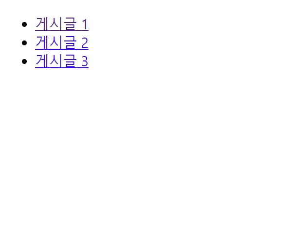
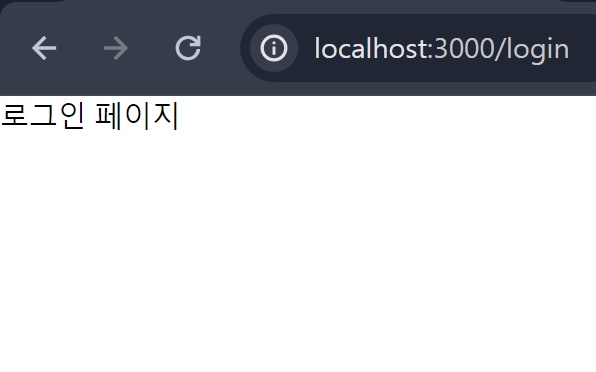
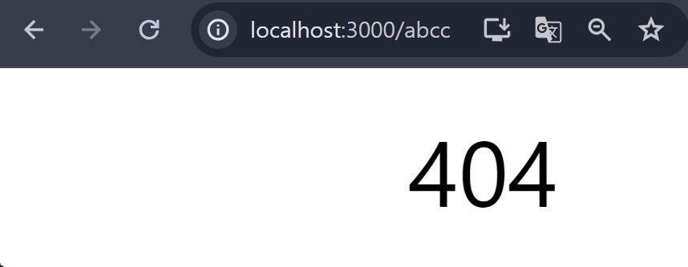

## Class0527 수업 정리

###  발표
<a href="https://dpwls03.github.io/React/0527/리액트 프로젝트 Github Pages로 베포하기.pdf">[발표자료]</a>

[발표내용]

리액트 프로젝트 Github pages로 배포하기에 대한 내용입니다.

Github Pages란?

깃허브 사용자가 공개 레파지토리에서 호스팅을 이용할 수 있도록 한다.

깃허브 페이지는 기본적으로 HTML, CSS, JS로 구성된 파일을 구동하고 배포해

static 웹 사이트를 호스팅 할 수 있게 해주는 서비스이다.

### 수업내용

#### TodoList 만들기

<a href="https://dpwls03.github.io/React/0527/build/">[Page]</a>
